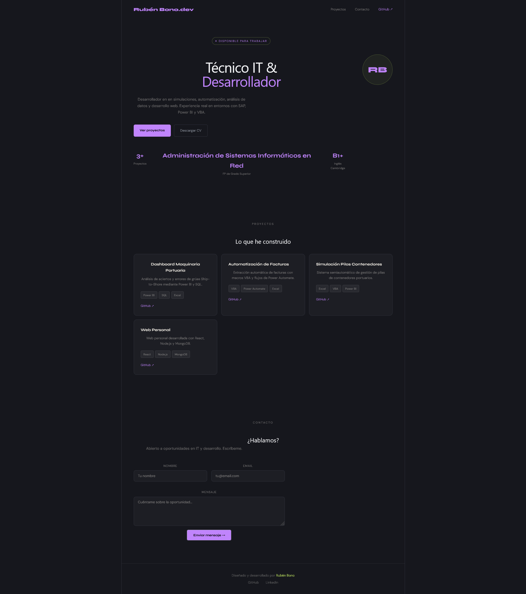

# 🌐 Portfolio Web Personal

Portfolio web personal desarrollado desde cero con React, Node.js y MongoDB.

## 🚀 Demo

> Próximamente disponible en producción

## 🛠️ Stack tecnológico

- **Frontend:** React + Vite + CSS personalizado
- **Backend:** Node.js + Express
- **Base de datos:** MongoDB
- **Control de versiones:** Git + GitHub

## ✨ Funcionalidades

- Sección Hero con presentación personal
- Proyectos reales con enlaces a GitHub
- Formulario de contacto funcional
- Diseño responsive y moderno
- API REST propia con Node.js
- Mensajes guardados en MongoDB

## 📁 Estructura del proyecto

website-portfolio/
├── backend/
│   ├── models/
│   │   ├── message.js
│   │   └── project.js
│   ├── package.json
│   └── server.js
└── frontend/
├── public/
└── src/
├── components/
│   ├── navbar.jsx
│   ├── hero.jsx
│   ├── projects.jsx
│   ├── contact.jsx
│   └── footer.jsx
├── App.jsx
└── main.jsx

## 📬 Contacto

- **LinkedIn:** [Rubén Bono](www.linkedin.com/in/ruben-bono-carrillo)